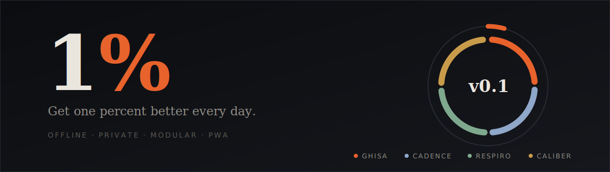

<p align="center">
  
</p>

<p align="center">
  
  
  
  
  
</p>

# 1%

**The operating system for getting one percent better every day.**

One app, many instruments. Enable only the modules you want; everything feeds one dashboard, one streak, one metric stream. Offline-first, no account, your data never leaves the device.

## Modules — v0.1

| Module | What it does | Quick action from Today |
|---|---|---|
| **GHISA** | Workout log — live sessions, sets × reps, volume, history | Start / resume a workout |
| **CADENCE** | Daily habits with streaks and 7-day strips | Check habits off directly on the dashboard |
| **RESPIRO** | Breathwork — Box, 4-7-8, Coherence, Physiological Sigh | Begin a session in one tap |
| **CALIBER** | Strength gauge — e1RM (Epley + Brzycki) and standards per lift | — |

**New in v0.2** — dark/light/system theme; a first-run intro where you pick modules (goal chips like *Strength & Gym* pre-select bundles, everything changeable later); per-module accent theming when inside a module; GHISA rest timer, previous-session values and live PR flags; RESPIRO per-protocol accents, glow, cycle counter and focus dim; CALIBER needle gauge; CADENCE 8-week heatmaps and milestone streak toasts.

The **Today** screen carries the signature *1% ring*: a hairline day-track with a literal 1%-of-circumference ember notch, and one inner segment per enabled module that lights up once the module has contributed to the day. Any logged action anywhere claims the day and feeds the streak.

## Deploy to GitHub Pages (web UI only, ~5 minutes, once)

1. Create a new **public** repository, e.g. `one-percent`.
2. **Add file → Upload files** and drag in everything from this folder **except** the `.github` folder (hidden folders don't always drag from Finder). Commit.
3. **Add file → Create new file**, name it exactly `.github/workflows/deploy.yml`, paste the contents of that file from this package, commit.
4. **Settings → Pages → Source: GitHub Actions.**
5. Wait ~90 seconds for the Action to finish. The app is live at
   `https://<your-username>.github.io/<repo-name>/`

Every future commit rebuilds and republishes automatically — you keep uploading changed files through the web UI exactly as before, the Action does the rest. On the phone, open the URL and **Add to Home Screen**: it installs as a standalone app and works offline after the first visit.

## Local development (optional)

```bash
npm install
npm run dev        # dev server
npm run typecheck  # strict TS pass
npm run build      # production build into dist/
```

Type errors never block deployment — the build strips types (Vite/esbuild); `typecheck` is a quality gate you run when you want it.

## Architecture

```
src/
├── core/        platform: types, storage, store, events, router, settings
├── design/      tokens.css + app.css (CSS custom properties, no framework)
├── app/         shell: App, TabBar, shared UI kit (sheet, ring, chips…)
├── screens/     Today · Modules · Settings
└── modules/     ghisa/ · cadence/ · respiro/ · caliber/
```

**The module contract.** Every module exports one `ModuleDefinition`: id, name, tagline, accent, `Screen`, `Widget` (dashboard card, may be interactive), optional `QuickActions`, and a storage schema version with a migration hook. Modules never import each other. Adding a module = one folder + one line in `core/registry.ts`.

**Two platform seams.**
- *Storage* — each module owns the namespace `op:v1:<id>`, payloads wrapped as `{ v, data }` and migrated on load; `localStorage` behind try/catch with an in-memory fallback.
- *Metric events* — modules append `{ module, kind, ts, value, unit, meta }` to one unified log. The ring, streaks and weekly stats read only this stream; so will cross-module insights and sync later.

**Deliberate choices.** Hash routing (refresh-safe on Pages, no rewrite hacks). Timestamp-derived timers everywhere (immune to background-tab throttling). Custom sheet modals, never native dialogs. Toast layer hard-wired `pointer-events: none`. Decimal-comma input accepted (`82,5` = `82.5`). Runtime dependencies: React and nothing else.

## Data

Everything lives on-device. **Settings → Export** produces one JSON backup covering every module; **Import** restores it. No telemetry, no network calls beyond Google Fonts.

## Roadmap

- **v0.3** — full GHISA depth: templates, per-exercise progression charts, e1RM handoff to CALIBER
- **v0.4** — Ora (fasting) and Minim (mood) as modules; insights v1 on the event stream
- **v0.5** — optional Firebase sync (the event log and namespaced docs are already sync-shaped)
- **later** — Capacitor wrap for App Store distribution, module marketplace layout

## License

[MIT](LICENSE) — do whatever you like, no warranty.
