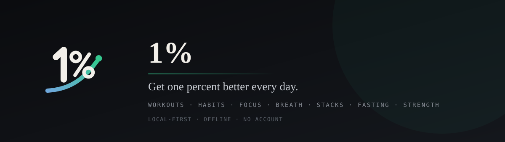

<p align="center">
  
</p>

<p align="center">
  
  
  
  
  
</p>

# 1%

**The operating system for getting one percent better every day.**

One app, many instruments. Enable only the modules you want; everything feeds one dashboard, one streak, one metric stream. Offline-first, no account, your data never leaves the device.

## Modules

| Module | What it does | Quick action from Today |
|---|---|---|
| **GHISA** | Workout tracker — Hevy-style planned sets you check off, templates, set types, per-exercise analytics, weekly stats | Start / resume a workout |
| **CADENCE** | Habits done right — build *and* quit habits, weekly frequency targets (3×/week…), Month backfill, Year grids | Check habits off directly on the dashboard |
| **GROVE** | Deep-focus timer — finish a session and a tree grows; your forest is your history | Focus 25 min in one tap |
| **RESPIRO** | Breathwork — geometric tracers, five protocols + custom, breath-hold test, your own Spotify audio | Begin a session in one tap |
| **SANA** | Stacks of supplements & medicines — dial, per-stack take-all, history heatmap, reference library | Doses left today |
| **CALIBER** | Strength meter — e1RM, level bar with your target marker, per-lift trends, standards tables | — |

**New in v0.22.1 — self-healing chunk loads; the "only GHISA works" incident**

Every deploy renames every hashed chunk, so a shell one generation stale — a waiting service worker, a cached index served during one flaky navigation — requests chunk names the server no longer hosts. That is exactly what broke six modules while GHISA survived on a cache-warm chunk. Two fixes. First, all twelve lazy imports (seven module screens, five shell screens) now go through `lazyRetry`: on the first failed chunk import it drops every cache, tells any waiting worker to take over, and reloads once; a session latch makes a second failure fall through to the module's error card instead of looping, and a healthy boot releases the latch. Verified by a suite that fails imports against shimmed caches/service-worker/location and asserts the exact sequence. Second, the v0.22.0 update flow made the in-app pill a mere fallback behind the notification channel — a missed notification could leave someone stranded on an old shell indefinitely. The pill now always shows; the notification is a bonus. Deploy, hard-refresh once, and this class of breakage heals itself from now on.

**New in v0.22.0 — native notifications, and alerts that survive a closed app**

WKWebView has no Web Notification API, so GROVE's timer and ORA's phase alerts would have gone silent the moment the app was wrapped for the App Store. Both now route through a second backend in `core/notify.ts`: Capacitor's LocalNotifications, reached through the runtime `Capacitor.Plugins` global rather than an import — deliberately, because adding the package to `package.json` would break the GitHub Pages build, which runs `npm ci` against the committed lockfile. Zero build dependencies; the native project installs it separately (documented in CAPACITOR.md).

This is more than parity. Native alerts can be **scheduled ahead**, so a focus session or a fasting stage now speaks even with the app fully closed — something the web API cannot do at all. A new `core/schedules.ts` keeps those pending alerts in step by subscribing to the GROVE and ORA stores and re-deriving what should be queued whenever state changes, rather than hooking start/pause/resume/reset/skip/give-up individually: no module logic was touched, so no timer behaviour can break, and no code path can leave a stale alert to fire at the wrong moment. ORA queues each fasting stage plus the target, suppressing a stage that lands on the target and dropping anything more than a day past it; GROVE queues the session end and reschedules cleanly across pauses. When a native alert is already queued the in-app notification is suppressed so nothing speaks twice, and turning a module off cancels everything it owns. Verified by a suite that runs the scheduler against a simulated Capacitor environment: correct queue times, id reuse on reschedule, no hash collisions, total cancellation.

**New in v0.21.3 — sheets are centred windows again**

Popups were opening from the top of the screen, under the status bar, because three of my own changes had stacked: v0.13 renamed the Sheet backdrop to a class with no CSS; v0.14 appended `.sheet { position: relative }` so workout confetti would stay inside its sheet, which silently overrode the `position: fixed` that anchored sheets to the bottom **and** disabled the wide-screen rule that centres them; v0.21.1 then gave the scrim a real full-screen surface, at which point a non-fixed child flowed from its top edge and the break became visible. The scrim now centres its child and `.sheet` is a true modal window — all four corners rounded, width capped, its own scroll, and safe-area padding held by the scrim so nothing can sit under the notch. It scales up to 560px on wide screens and springs in with a soft rise. GHISA's own sheet system (`.gh2-sheet`) is separate, was never affected, and still slides from the bottom.

**New in v0.21.2 — the bottom fade is gone**

The tab bars looked milky because of a compositing interaction rather than any opacity setting: `.edge-fade.bottom` painted a 96px band of background colour along the bottom of the screen, and although it sits behind the bar by z-index, the bar's own `backdrop-filter: blur(14px)` samples whatever is behind it — so the bar blurred that band into its own glass, module bars worst of all, while the band separately veiled the last card above it. The gradient is removed. The floating pill already has a translucent background and blur of its own, which is what makes content read as sliding underneath, so nothing is lost.

**New in v0.21.1 — v0.21.0 reverted**

The design-language pass is rolled back; the app looks exactly as it did in v0.20.0. It was wrong on taste — washed-out surfaces, an over-lit background — and it also carried a real layout bug: the layer set `.ring-center { position: relative }`, which overrode that element's `position: absolute; inset: 0` and dropped the hero number out of its ring, colliding with the label beneath. `src/design/system.css` now contains only two fixes worth keeping. First, shared sheets had lost their backdrop entirely back in v0.13, when `Sheet` was rewritten and the scrim element renamed to a class with no CSS: modals opened over undimmed content, and since the scrim wrapped a `position: fixed` panel it occupied no area at all, so tap-outside-to-close had nothing to catch the tap. Second, the top edge fade was sized `safe-area-inset-top + 48px`, so anywhere without a notch inset — desktop, a browser tab — it laid 48px of background over the screen title; it now scales from the inset alone, disappearing where there is no status bar to cover while still veiling the iPhone clock in standalone.

**New in v0.21.0 — the design system: "quiet instrument"**

One visual language for the whole app, written as a single reviewable layer (`src/design/system.css`, loaded last) rather than another generational patch — no component logic touched anywhere. An **8pt spacing scale**, larger calm radii (24px cards, 28px sheets), and a three-step **elevation model** where depth comes from light: an inner top highlight, a tight key shadow, and a wide ambient one. Surfaces are now subtly translucent with true hairline borders over a **lit background** — deep neutral carrying three faint radial washes instead of flat color — and nested cards step down a level instead of stacking shadows. Glass is spent only where things genuinely float: the tab pill (blur + saturation + hairline + deep shadow), sheets, toasts, and the update pill. Primary buttons gained a soft vertical sheen and an accent glow that collapses on press; inputs answer focus with an accent ring; the ring gauge sits in an ambient halo so the arc reads as lit rather than drawn. Motion speaks one vocabulary — `--spring` for anything that moves under a thumb, `--ease` for everything else, opacity-only for screen transitions (the v0.9.10 no-transform-on-wrappers rule is respected exactly). Also fixed on the way through: shared sheets had lost their backdrop entirely when `Sheet` was rewritten in v0.13 — `.sheet-scrim` never had CSS — so modals now dim and blur behind properly, and every sheet wears a grabber.

**New in v0.20.0 — the Chrome scroll bug, and the mark inside the app**

Fixed the intermittent dead page in Chrome, which was self-inflicted: v0.16's `overflow-x: hidden` on both `html` and `body` made **two** scroll containers (per spec, `hidden` on one axis forces the other to `auto`), and with `overscroll-behavior` blocking chaining between them, any touch landing in the container that wasn't overflowing simply refused to scroll. Horizontal drift is now held by `overflow-x: clip`, which clips without creating a scrollport, so the document keeps one normal scroller — with a `@supports` fallback for older Safari. GHISA's swipe-to-delete gained an **axis lock** as well: a gesture must prove itself horizontal (8px, and 1.2× more sideways than vertical) before the row moves, so dragging a set row scrolls the list like everywhere else and accidental deletes are gone. The brand mark is now the real vector everywhere it appears **inside** the app too — one `src/app/Mark.tsx` shared by the onboarding hero and the Settings about card, replacing the old text "1%", with the numeral on `currentColor` so it's correct in both themes — and the boot screen shows the mark breathing gently instead of a generic spinner. `banner.svg` was redrawn to match: new mark, jade rule, honest subtitle.

**New in v0.19.0 — one tab grammar, the jade identity, RESPIRO in violet**

Module tab bars now ARE the home bar: the buttons adopt the same `.tab` class, so the gliding pill, icon lift, and brightness are pixel-identical everywhere — the circular highlight was a buried legacy `.mtab.on` background fighting the glider across responsive layers, now structurally impossible; active icons tint in each module's own accent via a scoped variable. Back-swiping from Home can no longer fall off the app: the entry hash is normalized on boot and a hashchange guard pins any empty-hash landing back to `#/` (the white screen is gone). The notification per-module rows and the Display toggle wear a proper animated **Switch** (role="switch", sprung knob). And the palette settled: the app's main color is now **jade green** (`--jade`: #35c78f dark / #178a57 light) driving `--accent` and `--good` — the 1% ring and the ledger bars are green in both themes, the boot spinner matches — while **RESPIRO moved to violet** (#a78be0 / #6b4fbf) everywhere its accent variable reaches, clearly distinct from GROVE's green and GHISA's ember.

**New in v0.18.0 — gliding module tabs, a notification center, modules over time**

The sliding-pill motion now works in every module tab bar (a selector bug had kept it exclusive to the main bar) and both bars are brighter — the active pill carries more ink, module tabs light to full ink with the underline retired. Settings gained a **Notifications** section: one master switch (with honest iOS install guidance), a per-module On/Off list, and a new `core/notify.ts` gate that GROVE's timer and ORA's phase alerts already route through — and **app updates now arrive as a system notification** (tap to restart); the in-app pill only appears when notifications are off, blocked, or unsupported. On Profile, the ledger switched from ember to the app's own jade — won weeks at full strength, misses receding — so it can never be mistaken for GHISA again; beneath it, a new **Modules over time** chart draws each module's weekly score as a thin line in its own accent, with a dashed guide at 100, gaps kept honest, and the same ≤5-label rule as every other chart. It appears with two or more modules enabled and can be switched off under Settings → Display.

**New in v0.17.0 — the new mark, edge fades, gliding tabs, house area charts**

The new 1% brand mark — white numeral, gradient swoosh rising to a jade endpoint dot — is applied everywhere: favicon, PWA icons, maskable, apple-touch, App Store 1024, and all seven iOS splash screens, drawn as pure vector geometry so it's crisp at 16px and 1024. Hevy-style **edge fades** now melt content into the background at both screen ends (theme-aware, safe-area sized), so the clock and notch always sit on clean ground. The bottom pills got their motion: a measured **sliding indicator** glides between tabs with a soft overshoot and the icons give a tiny lift — main bar and module bars both, including the scrollable ones. Exercise-detail charts joined the house grammar: a new `AreaLine` (smooth path, soft fill, endpoint dot + value tag, ≤5 horizontal labels — the rotated clipped months are gone) now powers GHISA's 1RM/Volume progression. And confirmed after inspection, not changed: **PR badges are already live** — `detectPRs` runs the instant a set is marked done, comparing against all saved history for Weight, 1RM (Epley), and Reps.

**New in v0.16.0 — native lock, house charts, swipe-to-delete**

The app now behaves like an installed app: pinch and double-tap zoom are disabled in standalone mode (`user-scalable=no` + `touch-action: manipulation` — browser-tab Safari deliberately keeps pinch as an accessibility backstop), and sideways drift is gone (`overflow-x` clipped at every level; the iOS edge-swipe-back system gesture is untouched). Module headers state only what a module *is* — "Workout log", "Habit tracker" — no more truncated taglines. Charts got a single house grammar in `src/app/charts.tsx`: gradient bars with soft-rounded tops over faint full-height rails, at most five axis labels (first and last always, collisions impossible), and a rolling-mean **trend line** with an endpoint dot riding over the bars — applied to the Profile ledger (won weeks tint jade), GHISA's volume chart, the engine's week-by-week, and a matching house sparkline for CALIBER. And GHISA's swipe-left-to-delete is back from the prototype: track the finger, the row slides off a red Delete field, past half-width it's gone — with a new `removeSet` model action that blanks the last remaining set instead of orphaning the card.

**New in v0.15.0 — the showroom round: persistent player, 12-month sample data, premium icons**

RESPIRO's docked player now survives everything short of leaving the module: the shell remounts screens on every tab switch by design, so the dock moved out of the keyed tree into an app-level component that follows the route — music keeps playing across RESPIRO's tabs and the dock greets you again on re-entry. Sample data grew from four weeks to **twelve months across all seven modules**, deterministic (seeded RNG — screenshots re-roll pixel-identical), with real names (six CADENCE habits, three of them seam-linked to GROVE/RESPIRO/ORA truth), vacations, deloads, a year of weekly weigh-ins, five CALIBER lifts — and the engine contract intact: the two most recent closed weeks win (106/107), the third misses honestly (99), and the 26-week ledger fluctuates at 7 wins. One central **Load/Remove switch now lives in 1% Settings** (the per-module blocks are gone), and a latent bug it would have tripped is fixed: an old find-and-replace had demo-tagged *real* workout ids in GHISA — removal now filters by an explicit id list, never by id shape. All seven module glyphs were redrawn fuller and bolder, and ORA's stopwatch retired in favour of an eating-window ring.

**New in v0.14.0 — App Store runway, rituals, celebrations, cloud scaffold**

Capacitor is scaffolded (`capacitor.config.ts` + the complete beginner walkthrough in `CAPACITOR.md`, from $99 enrollment through TestFlight to review notes) — same `dist/`, two targets; GitHub Pages continues untouched, and the service worker now registers only on https so the native shell stays clean. New **week-close ritual**: the first visit after a week freezes greets you once — score, banked-or-honest-miss line, per-module chips, confetti when won. **First-week coaching**: with an empty ledger the hero explains that this week writes your starting lines instead of showing a bar you can't have yet. **Workout celebrations**: every GHISA save rains emoji confetti (more on PR days) with a cheer line over the existing PR/volume highlights; reduced-motion shows none of it. **Cloud backup scaffold**: `src/core/sync.ts` loads Firebase from the CDN at runtime (zero build deps), Google sign-in, one-document backup/restore reusing the exact local export payload — dormant until you paste a config, with the five-minute activation documented inline; the Settings card explains itself meanwhile. Plus `appstore-1024.png` and native detection in `src/core/native.ts`.

**New in v0.13.0 — production hardening: full PWA, a11y, code splitting**

Complete PWA pass: manifest with id/orientation/categories/maskable icons, regenerated brand iconography from one geometric SVG (favicon → 512 → seven iOS splash screens), dual theme-color, inline boot screen (no white flash), install-time shell precache, and person-controlled updates — the new service worker waits and an "Update ready — Restart" pill hands over the moment. Every module screen is now its own lazy chunk (+ its settings block, same chunk), shells split, React vendored: the eager path is ~61 KB gzip. Accessibility: pinch-zoom restored (WCAG), dialog Sheets with focus management and Escape, skip link, landmarks, live-region toasts, labelled rings, focus-visible outlines, ≥36px close targets, global reduced-motion. Native feel: press feedback on every button, overscroll containment, keyboard-safe focused inputs, offline/online toasts, global error nets. Full audit in LAUNCH_AUDIT.md; verified by complete esbuild bundling and a server-render smoke of every route and every module screen.

**New in v0.12.3 — cumulative resync of v0.12.0–v0.12.2**

Identical content to the last three deltas, re-cut as one package so a repo at any of those states converges: hierarchical back navigation, Today live-swap reorder, grove break escape, matched tab icons + fixed 88px tabs, unified sliders settings icon, general Philosophy (onboarding + engine), plateau shelf-life, Profile weekly recap **with per-module coaching lines**, ring glow unclipped, SANA gold. Settings should read **v0.12.3** after deploy — if it doesn't, the build didn't land.

**New in v0.12.2 — the glow breathes, SANA goes gold**

The ring gauges' soft glow was being clipped square: the value arc's drop-shadow extends past the SVG viewport, and SVG hides overflow by default — so the fade died at the box edge. Rings (hero and per-module) now declare `overflow: visible` and the glow falls off naturally in every direction. SANA's accent moved from teal-green to **gold** (`#e0bf5c` dark / `#a8821f` light) — unmistakable next to GROVE's green, RESPIRO's jade and ORA's teal, and it suits the supplement-brass vibe.

**New in v0.12.1 — recap coaching, a general philosophy, and the pill finally equal**

The Profile weekly recap now carries each module's **own coaching line** — the same generators behind Today's Next moves — so a short week reads "add ~240 kg across your remaining sessions" or "ten breathing minutes a day closes it," per module, under its numbers. The Philosophy was rewritten as a **general introduction**: 1% weekly, compounded; every module an instrument feeding one weekly score; the bar grows from your own pace — with the exact arithmetic deliberately left to the engine page (no more duplicated mechanics). The floating pill's active highlight was content-sized, so SETTINGS made a wider blob than TODAY — tabs are now fixed at 88px each, identical blob whichever is active. And the **settings icon is one design everywhere**: the slider-rails glyph now serves the main tab, every module's Settings tab, and GHISA's header.

**New in v0.12.0 — navigation that thinks in structure, and the app explains itself**

GROVE's timer trap is fixed: breaks now have a true stop — tap any mode chip mid-break and it cancels and switches in one motion, or use the new "Stop the break" button. Focus runs stay protected (Give up and Skip remain their only early exits — the tree is the point), and the mode chips dim during focus to say so.

The **back gesture is remapped to structure**: from any module tab it returns to the module's start page, from there to the Today overview, from Settings/Profile/the engine to Today — never back through five hops of tab-flipping. Modules → Settings, since that's where it lives now.

Today's module reorder now uses the **same live-swap mechanic as Settings → Modules**, ported to variable-height cards: the card follows your finger and the list reorders the instant you cross a neighbour's midpoint. The tab bar icons were redrawn to matched optical weight (the gear was visually the heaviest, the ring the lightest) — three tabs, genuinely identical.

The **1% philosophy** now has a home: a first-run page before module selection ("here's the whole idea"), and the same text inside the engine deep-dive. The plateau nudge ("held at your goal for N weeks") gained a shelf life — it appears after 3 held weeks, retires after 6, and multiple holds condense into one line.

**Profile gains a weekly recap** between the ledger and the module list: this week vs last, per module, straight from the engine's own measures — "+2.1% vs last week · pace met" in green, or the exact shortfall with a per-day hint ("240 kg short · ~80/day left"), habit and dose weeks in percentage points. Nothing in it can disagree with the ring, because it's computed by the same code.

**New in v0.11.4 — the live workout fits, and the shell slims to three tabs**

The live-workout set rows were overflowing on phones: the two number inputs refused to shrink below the browser's intrinsic input width, blowing the grid so PREV wrapped vertically and the ✓ column fell off-screen. The grid now uses shrinkable minmax columns with fixed rails for the set-number and check, inputs carry `min-width: 0`, and PREV truncates with an ellipsis instead of wrapping — the header row mirrors the same template. Anti-zoom 16px inputs stay.

The main tab bar is down to **Today · Profile · Settings** — three equal columns, identical icon sizes, the same fixed-width active underline whichever tab is selected. **Modules moved into Settings** as the first row (enable, disable & reorder), with a back link from the Modules screen; the Settings tab stays lit while you're in there. Settings' version line now reads the truth again.

**New in v0.11.3 — chart polish for the MVP**

GHISA's Home chart now follows the period control instead of always showing eight weeks: Week shows daily bars, Month shows the last five weeks, Year shows twelve months, All shows months since your first workout. The Profile chart's Year view buckets by month too, both charts (and Statistics) **start where the data starts** — no leading dead space — and the angled, spilling month labels are gone: labels are horizontal and thinned to at most six, so they always fit. SANA's Consistency is now the full calendar year like CADENCE, month labels on top, horizontally scrollable and landing with the current week around the middle. Also fixed a latent audit blind spot: generic hook calls like `useRef<T>()` weren't matched by the import audit — pattern upgraded, platform clean.

**New in v0.11.2 — the engine lights up + the GHISA settings crash**

GHISA's settings crash ("SampleDataBlock is not defined") was a wiring script inserting imports after "line 1" — which in GHISA's screen is the opening of a doc comment, so both imports became comment text. Fixed, and the pre-delivery audit now strips comments before checking imports, so presence can never again masquerade as liveness.

"Your 1%" showing zero weeks won had four stacked causes, all fixed. (1) The engine measures GHISA and GROVE through session/focus **events**, but their sample loaders wrote only store state — demo weeks contributed nothing; both now mirror every sample workout and focus session into tagged events (exactly like real finishes do). (2) Completed weeks **freeze** into the ledger, so weeks frozen before data existed stayed junk forever; every sample loader now calls `resetLedger()`, and the next visit to Your 1% refreezes all closed weeks from actual data. (3) The sample histories themselves never cleared 100%; they're now **week-boundary-aligned**: the two most recent closed weeks are genuinely strong across every module (perfect habits and doses, all fasts on target, growing volume/focus/breathwork, a strength test up), the third closed week is an honestly human miss. (4) Grove's forest is reshaped onto an exact ≥2% weekly growth curve with a per-day focus floor across both closed weeks, so the linked CADENCE habit ticks through the real integration rather than around it. Verified end-to-end by a mini-engine over the seeded state: week −1 scores 106, week −2 scores 104 (both won, +2.01% compounded), week −3 scores 97.

**New in v0.11.1 — mobile hardening + sample data everywhere**

The app now behaves like an instrument, not a document: long-pressing no longer selects text or pops the iOS Copy/Translate callout, and images can't be drag-lifted — while every input and textarea keeps normal text selection for actual typing. Inputs are pinned to 16px so iOS stops zoom-jumping the page when a field gains focus. Notch fixes: GHISA's full-screen exercise sheet, the live-workout header and the media lightbox all pad below the status bar via safe-area insets (the tab bar and bottom sheets were already safe).

Every module now offers **Sample data** in its settings (gear → module): load a few weeks of plausible history to see the product fully alive, re-roll it, or remove it in one tap. All of it is tagged end to end — workout/habit/stack/fast ids carry a marker, and entries without ids (Caliber tests, SANA doses, ORA weight/hydration) are tracked by explicit bookkeeping — so removal is surgical and user data is never touched. GHISA's older demo loader was retro-tagged and gained the surgical remove it never had. Sample focus minutes, breathing sessions and fasts flow through the real integration seams, so the CADENCE bars and ticks light up too. The whole feature strips out before launch with one grep for the tagged blocks.

**New in v0.11.0 — ORA, and the modules start talking to each other**

The Respiro **Sound tab is fixed** — the rebuilt root was routing on a tab id that didn't exist ('tools' vs the real 'sound'), so the tab rendered nothing. One word.

**CADENCE habits can now carry a daily time goal** (the − / + stepper in the editor, minutes, 0 = off), and three new presets seed one: **🎯 Focus time (2h)**, **🌬️ Breathwork (10m)**, **⏳ Fasting (16h)**. That target is the hinge for three new integration seams: **GROVE** focus minutes, **RESPIRO** session minutes and **ORA** fast hours each stream into any matching habit — partial days paint the fraction bar, reaching the goal ticks the habit with the full ceremony, and removing a session honestly demotes the tick back to a bar. Matchers go by name or emoji, so your own phrasing works too; habits without a target are never touched.

**ORA is rebuilt to the prototype** on top of the existing model: eleven protocols (window, custom, five daily rhythms, four extended water fasts), the ring that wears the metabolic stages as bezel arcs and **tints the whole surface to your current stage**, the hour-by-hour Body timeline with live Now-chip, post-fast **eating windows** for sub-24h targets, milestone **celebrations** (earned once, quietly seeded for existing history — no confetti storm), an editable fast log, and the Progress tab's recent-fasts chart, 17-week consistency, weight and hydration. Existing improvements kept: event-stream logging, streak math, module settings via the gear.

**New in v0.10.9 — RESPIRO: the instrument + SANA hotfix**

RESPIRO is rebuilt around the prototype's central idea: **the geometry is the timing**. Every technique draws to scale — box is a true square, 4·7·8 is the unique cyclic polygon whose sides are 4, 7 and 8 seconds long — and one comet travels the shape at constant speed, so **every phase change lands exactly on a vertex**. That's the fix for the old engine's wrong execution: it interpolated between hand-placed points at uneven speeds; the new one cannot lie. With it: the breathing core + glow that swell with the breath, phase chimes (C-major tones per phase) and haptic patterns, the synthesized ambient drone that follows your breath, wake-lock, a 3.5 s settle-in, the sigh's double-inhale done properly (first sip to 55%), Nadi Shodhana's twin channels with the lit nostril and crown holds, and full **Wim Hof rounds** — rhythmic breaths, retention with an "I need to breathe" button, 15 s recovery, best-holds recorded. The **custom pattern studio now lives inside its config sheet**: tune the four phases and watch the polygon redraw live. Sessions ≥ 30 s log to history exactly as before.

**Sound**: a proper library alongside the settings — save **Spotify or YouTube** links, tap ▶ to dock a player above the tab bar that keeps playing while you practise. **YouTube plays full-length** (no login, no keys); Spotify plays full tracks only when this browser is logged into Spotify — the sheet says so honestly.

Plus the SANA hotfix (the `useEffect` import the error card caught — thank you, error card) and a new permanent pre-delivery audit that greps every screen for hooks missing from their React import, so that class of bug can't ship again.

**New in v0.10.8 — SANA↔CADENCE, doses, day pager, the last sun**

SANA's Today header is a proper **day pager** now: ‹ › shift days, and when you're in the past the center label becomes a button — tap to jump straight back to today. The compound **library grew to 45 entries** (Curcumin, Berberine, CoQ10, Resveratrol, Lion's Mane, Bacopa, Alpha-GPC, Ginkgo, vitamins A/E, Calcium, Potassium, L-Carnitine, ALA, 5-HTP…), five long-standing duplicates were purged, and **every compound's dose is now tunable** — open its ⓘ sheet and the dose line is two live fields (amount + unit), saved on blur.

**CADENCE speaks fractions** (schema v5): a new `progress` layer under the boolean checks. `setCheckFraction` is the authoritative write — a full day promotes to a real check with the full ceremony (event, streak toast), a partial day paints a **progress bar right on the habit row** ("64%"), a drop demotes honestly. The 'Vitamins' preset is now **'Supplements 💊'**. And the new `sana/integrations.ts` (the module's only cross-module seam, GHISA precedent) subscribes to the dose log: any change to any day's taken-list streams that day's fraction into every supplement-reading habit (name EN/IT or 💊/🧬 emoji, build-type only) — take all 13 and the habit ticks itself; take 8 and CADENCE shows 62%. Fault-isolated both ways.

The **core tab bar's sun** — the last survivor — is now the same gear as everywhere else.

**New in v0.10.7 — shell hardening + module reorder**

Fixes the black-screen after loading GROVE sample data — two layers deep. First, the **shell finally has error containment**: every module screen, dashboard widget, and quick action now renders inside an error boundary, so a crash anywhere becomes a contained card that *names the exact error* (screenshot = bug report) with Try again / Back to Today — never a black app. Second, the first-time-exercised companion path in GROVE was armored: the nested-SVG-inside-transformed-group construct (a known browser-quirk class) is gone, animal name→sprite lookups have fallbacks, every rendered coordinate is finite-checked, dates use the spec-safest locale form, and demo ids are collision-proof and self-describing (`…-d17`). The headless seed→render pipeline test (71 plants, ids, coords, kinds, dates, painter sort) runs clean.

And the 1% overview learned **drag-and-drop module ordering**: grab the six-dot grip on any module card, drag, drop where the indicator line shows — the order persists (it *is* the enabled array, which was already ordered by design; the UI just caught up).

**New in v0.10.6 — GROVE: the prototype rebuild**

GROVE is now the dark prototype, living inside the shell: brass focus and eucalyptus breaks with the whole accent system swapping per phase, the machined conic-bezel dial with its 60-tick ring, per-mode length chips (15/25/45/60/90 for focus, shorter sets for breaks) plus a **✎ custom** chip and click-the-time-to-type — one-off lengths apply *to this round only*, defaults live in Settings. Cycle dots track a configurable **long-break-after-N** (2–8), with auto-start toggles for breaks and focus, a completion **chime** (synthesized, no assets) and optional browser notifications. Keyboard on desktop: space, R, S, 1·2·3. Today's grove grows a live tree as the session runs.

The forest went **dimensional**: split-lit pine tiers, radial-lit oak and birch canopies with rim light, gradient trunks — and the companions (rabbit, fox, deer, bear, owl) got the same treatment, roaming the isometric stage on their own. Drag any plant to rearrange, drop it on another to swap, Shuffle re-rolls the whole layout. Kept from the app on purpose: **breaks grow nothing** — they're for you, not the grove — the four-tab structure, and the current companion thresholds (10/25/50/100/200 h).

Settings (gear tab) now hosts the long-owed **sample data** loader: six weeks of tagged sessions to see the forest full — and because every demo entry is tagged, *Remove sample data* strips only those, never a real session. Export/Import moved here too (imports run through the same normalizer as migrations), plus the armed two-tap **Erase all data**. No offline/private/no-account copy anywhere — this app is online. Schema v3 migrates v2 state untouched.

**New in v0.10.5 — GHISA: living charts, module talk, 60 exercises**

The per-exercise progression chart now **draws itself left to right** on open and on every 1RM ↔ Volume switch — the prototype's animation, rebuilt in raw SVG (clip-path reveal, ~0.9 s). Bars grow from the baseline with a light stagger, everywhere. Dense chart labels (6-month, year, long histories) sit at a **–32° angle** so months never collide. Tabs reordered: **Exercises before Profile** — Profile now sits second from the right, beside the gear.

First **inter-module conversations**: finishing a workout hands your best session e1RM to **CALIBER** for its six standard lifts (bench, squat, deadlift, OHP, row, pull-up) — only when it beats CALIBER's stored PR, so its test history stays honest; pull-up pushes only when Measures knows your bodyweight, since CALIBER's pull-up standard is bodyweight-based. And any **CADENCE** build habit that reads as training — name matching workout/gym/train/palestra/allenamento or a 💪/🏋️ emoji — gets **checked off automatically** for the day. Both run fault-isolated in `ghisa/integrations.ts`: if a sibling module ever breaks, the workout still saves. The finish summary lists what happened ("→ CALIBER: new BENCH PR logged", "→ CADENCE: 'Workout' checked").

The library grew to **60 movements** (T-Bar Row, Good Morning, Hack Squat, Goblet Squat, Sumo Deadlift, Arnold Press, Close-Grip Bench, Chin-Up, Pec Deck…), each with a coaching cue and a photo mapping — schema v8 folds them into existing installs. Re-run `node scripts/verify-ghisa-media.mjs` to validate the 20 new image mappings.

**New in v0.10.4 — GHISA polish + platform gear**

The 1% overview grows a **Start workout** chip under GHISA: tap it for a small routine menu — your templates plus an empty session — and you land straight in the live workout (it reads *Resume workout* when one is running). The Profile chart's 6-month and year views now label **month boundaries only** (Feb · Mar · Apr), so nothing crams. Exercise pages gained a **one-line coaching cue** for all 40 library movements (setup + execution, ember-edged card) and the demo photo is now **tappable — opens a full-size loop** in a lightbox; list thumbnails got more breathing room from the text. The Train cards' pen and trash are now proper 48 px bordered buttons (trash in warning red with its own tint) with cleaner lucide glyphs. And platform-wide: the Settings tab's sun-like asterisk is finally a **real gear**, in every module and the core app.

Data note: library exercises refresh from the built-in catalog on load (schema v7) — that's how existing installs receive the cues; custom exercises are untouched.

**New in v0.10.3 — GHISA: Profile tab, CALIBER-parity math, exercise media**

The History tab is now a Hevy-style **Profile**: a metric chart (Duration / Volume / Reps over 3 m / 6 m / year), a 2×2 dashboard — **Statistics** (all-time totals, 8-week volume, sets per muscle group), **Exercises** (everything you've trained, most recent first), **Measures** (height plus manual body-measurement log: weight, chest, waist, hips, biceps, thigh), **Calendar** (three months, training days in ember, week streak and lifetime rest days) — and the full workout history below, exactly where it used to live (old `/history` links land here too).

e1RM math is now **formula-identical with CALIBER**: both modules import the shared `core/strength` Epley, and the 1RM calculator mirrors CALIBER's dual readout (Epley to 0.5 kg as the headline, Brzycki to 0.1 kg beneath). The dumbbell icon is the prototype's exact lucide glyph everywhere — module mark, Train tab, in-screen. Template cards drop the ⋯ menu for a pen + trash pair (trash confirms before deleting).

Exercise rows and detail pages now carry **demonstration photos** from free-exercise-db (MIT, ~870 exercises): two poses that flip like a short loop on the detail page. Images are hotlinked; anything unavailable — custom lifts, offline, an unmapped name — falls back to a clean monogram tile. Run `node scripts/verify-ghisa-media.mjs` locally once to confirm all 41 mappings against the live dataset.

**New in v0.10.2 — GHISA, rebuilt from the prototype**

GHISA is gone and rewritten from the ground up against the standalone prototype — not patched, rebuilt. The forged-iron dark theme now renders pixel-faithful (its own `--g-*` palette: `#0B0C0E` ground, ember `#F97316`, chalk text), and light mode maps the same layout onto app tokens. The module is now four tabs mirroring the prototype exactly — **Home** (period stats, 8-week volume bars, streak, recent, resume-in-progress), **Train** (start empty or from a template, full template editor with per-exercise set steppers), **History** (every session, tap for the set-by-set breakdown with per-set e1RM and PR flags), **Exercises** (searchable library + muscle filters, custom exercises, per-exercise detail with heaviest / best-1RM / most-reps / sessions and a 1RM-vs-Volume progression chart).

The live workout is the prototype's: Prev-value tap-to-fill, set-type cycling (Normal / Warm-up / Drop / Failure), supersets, an auto **rest timer** with ±15s and skip, live **PR detection** (weight / 1RM / reps, warm-ups excluded), and a **1RM calculator** (Epley) in the header. Finishing shows the trophy summary with any personal records and all-time volume PRs. Charts are hand-rolled SVG (no chart dependency); icons are local strokes.

Your existing GHISA history is **migrated, not discarded** — old name-based sessions and templates resolve onto the library (unknown movements become tagged customs, muscle inferred), so nothing you logged is lost. Finished sessions still feed the weekly 1% as training volume.

**New in v0.10.1 — GHISA, prototype-true**

The set number is now the control it deserved: a wide badge that opens a **Hevy-style pop-up menu** — Normal / Warmup / Drop / Failure, each color-coded (W amber, D violet, F red) — instead of blind cycling. Finishing a workout earns a **celebration sheet with confetti**: volume banked, sets, total reps, and any **weight PRs** called out by name. A fourth tab, **Exercises**, lands with search and muscle filters — *Your exercises* on top (most recent first, with lifetime set counts), the full library beneath, every row opening the per-exercise page (best set, e1RM trend, volume, PR history). The template editor rows grew a muscle · sets · reps subtitle — pick movements and rep schemes there; weight stays where it belongs, in the session. Module tab icons now light **module-accent when active** (platform-wide), GHISA's ember is the prototype's `#f97316`, and the swipe-to-delete keeps its full-red, commit-at-half physics.

**New in v0.10.0 — CADENCE, prototype-true**

The whole module rebuilt against the Cadence prototype, and three bugs owned. The invisible check circle wasn't hidden — it was painted with tokens that don't exist (`--line-strong`, `--ok`), so the border computed to transparent; every cadence style now lives in one consolidated CSS layer where nine generational layers used to fight. The teal "Add habit" button was escaping too: sheets portal to `<body>`, outside the module's accent scope — the shell now mirrors the active module's accent onto `:root`, so dialogs keep their module's color everywhere.

- **The prototype's model, honestly migrated.** Habits repeat **Every day or on Specific weekdays** (days-per-week is gone — a "3 of 7" has no honest weekday mapping, so legacy habits arrive as daily; one edit sets the real days). Every habit has a **Start date** ("days before this aren't counted" — enforced in streaks, rates, grids, and the check guards). Quit habits get a **quit date** and clean-run math from it.
- **Today, the prototype card.** 4 px accent bar, tinted emoji tile, cue line, 🔥 streak + **Strength** (a 30-day-half-life consistency EMA), the 7-square week strip on *every* row — quit rows included: clean days in the habit's color, **slips in red**. Builds get a real 36 px check circle; quits the clean-day number, the Log slip pill, and the next-milestone whisper ("3 days to 7"). Rest days dim with a badge. The **ring summary card** ("All done 🎉 · Great consistency today", with a teal glow when the day is swept) and **Jump to today** complete the header.
- **Month, corrected.** Slip-red is **gone from the overall calendar** — a slip lowers the day's teal like any miss; red lives only in the habit's own squares. Below it, the **By habit** panel: each habit's full-month strip (tap any cell to fill in or fix that day — checks *and* slips), rate this month, streak or days clean. Calendar days open in Today. Mood joins the stats (month average face).
- **Year, the real year.** A **‹ 2026 ›** pager over the actual calendar year, January to December, today outlined *where it actually falls* — plus the "Everything" heatmap, per-habit grids with Rate / Best / Strength, an average-mood tile, and auto-scroll to now.
- **The form, complete.** Build/Quit type cards with descriptions, the prototype's 12 saturated habit colors, Every day / Specific days, start date with its honest hint, cue with the when/where nudge — and the primary button finally wears CADENCE teal.
- **Chrome.** CADENCE's accent is the prototype's teal (`#2dd4bf` dark / `#0ea5a0` light), the waveform logo is the prototype's own mark, and module logos platform-wide shed their boxes — a mark, not a tile. Sheets on screens ≥640 px now open as **centered dialogs** instead of hiding at the bottom.

**New in v0.9.10 — hotfix: the wandering tab bar**

One root cause, two symptoms. The v0.9.9 view transition animated `transform` with `fill-mode: both`, leaving a permanent transform on every screen wrapper — and a transformed ancestor becomes the containing block for `position: fixed`. The module tab bars (rendered inside the wrapper) detached from the viewport, drifted into the content, and their hitboxes swallowed taps on whatever sat beneath — which is why CADENCE rows "couldn't" be logged and the new slip visuals seemed absent: the check circles, red slip squares, and one-tap slip were all in the build, occluded and tap-blocked by the stray bar. Transitions are now opacity-only (no transform, ever, on screen wrappers); the pills float again with a visible 10 px gap; the today-cell in the week strip gained a subtle outline so the current square reads clearly.

**New in v0.9.9 — prototype-true details, and one deep bug**

- **The SANA popup bug was a CSS law, now repealed app-wide.** `position: fixed` gets trapped inside any transformed ancestor — the quick-log sheet was rendering inside a pressed card's transform, hence the mid-page float. Every Sheet now portals to `document.body`: bottom-docked always, everywhere. The quick-log sheet also gained **"✔ Everything — N remaining"** as its first row.
- **CADENCE, per the prototype**: the week strip is **squares** — habit-colored when checked, **red on slip days**; build rows carry the **empty circle → green ✓** check on the right; the emoji picker grew to 40; and the Mood label now shows the **7-day average face** beside it, so logged moods are visibly going somewhere (they also feed the Today cross-note).
- **GHISA**: chooser rows are consistent (Empty workout is a row like the templates, not an orange shout); **+ New template** is a chip; the swipe shows a **full red underlay** and commits at **half the row width** — the physics you asked for; and template exercises accept a **rep scheme** ("15·12·10·8" in the editor) that sets both the set count and each set's prefilled reps on start.
- **Chrome, Instagram-compact and fluid**: 54 px pill, 20 px icons, 8.5 px labels, bottom-hugging; every screen and tab change animates in with a 200 ms rise-and-fade (respecting reduced-motion).

**New in v0.9.8 — the corrections round (with a confession)**

An audit against the last feedback found three items genuinely missing and three already shipped but unseen. The confession: some v0.9.7 edits used unverified string replacements — one (SANA's method picker) silently failed against a renamed heading and reported success anyway. All replacements are now assertion-guarded. The already-shipped trio — GROVE's start-sheet, RESPIRO's in-module browse toggle, the gear icon — appear after upload + hard-refresh (they landed in v0.9.7's sw bump).

- **Overview chips, single-entry everywhere.** RESPIRO's Today chip is one "Start breathwork" (the two protocol shortcuts are gone); CALIBER's widget dropped the per-lift e1RM list for a one-line summary plus a **"Log a strength set"** chip.
- **SANA**: the **Quick-log method** picker (By stack / By time of day) now truly sits atop the Stacks tab — asserted this time; and **everything unticks**: compound checks always toggled (with proper labels), and now a completed stack's ✓ untakes the whole stack too.
- **CADENCE slips are unmissable**: the quit row goes red-edged with "0 · slipped today" on the day it happens; the Month calendar marks any-slip days in red (streak days keep their green levels); the Year heat's slip class finally has its red CSS.
- **Nav, compact and low**: pill dropped to the true bottom (6 px + safe-area), padding tightened, 21 px icons, smaller labels — less chrome, more app.

**New in v0.9.7 — real glass, and the Profile**

- **Actual translucency.** The chrome read as black because a dark tint over a near-black page *is* black. The recipe changed: a faint white gradient sits over a much lighter surface tint (~52%) with 28 px blur and boosted saturation — content now visibly ghosts through the pill and the floating back button, Hevy-style, in both themes.
- **A Profile tab** between Modules and Settings: weeks won / attempted, the compounded total ((1+rate)^wins), best week, the 16-week ledger, a link to the 1% engine — and a per-module all-time recap: lifetime kilos lifted, hours focused, minutes breathed, hours fasted, doses logged, best e1RM, each with its weeks-won count, each row opening its module.
- **One Start everywhere.** GHISA's widget lost its duplicate button — the quick-action chip is the single entry and it opens the chooser on arrival. The template pencil folded into the ⋯ menu ("Edit template", first item).
- **Sheet-first starts, the GHISA pattern generalised.** RESPIRO's overview shows Continue-with plus one "Choose a different protocol ▾" control that reveals the library on demand. GROVE's Start (in focus mode) opens a duration sheet — preset chips, custom minutes, "▶ Begin · N min" — so the dial never hosts a wall of options.
- **SANA quick-log, your mental model.** The Today chip reads "Log stack · N left" or "Log doses · N left" and opens a sheet of stacks or of time-of-day slots — one tap takes everything remaining in the group. Which model it uses is chosen in the Stacks tab: **Quick-log method — by stack / by time of day.**

**New in v0.9.6 — lucent chrome, and the machine bends to its owner**

- **The GHISA exercise rows, rebuilt from zero.** A v0.5 base rule still declared `.gh-row` as its own grid, so the new inner wrapper was being crushed into a 26 px first column — the "completely wrong" you saw. The old grid is now structurally dead; the inner owns a clean five-column template (set · prev · kg · reps · check), edge to edge, header on the same rails, the × retired in favour of swipe.
- **Hevy-school lucent chrome.** The back button floats — fixed top-left, circular, heavily blurred and translucent, following you down any scroll, always reachable. The nav returned to a **floating translucent pill** (this supersedes the docked bar): strong backdrop blur, and the active tab wrapped in an accent **bubble** with its own soft glow — the Hevy profile-tab feel.
- **The widget behaves.** GHISA's Today card is one stat line and one **Start workout** pill; tapping it lands in GHISA *with the chooser sheet already open* — empty or template, decided in one place.
- **CALIBER is modular inside.** OHP and Row are back; the profile gained **Your lifts** — toggle any of the six, and the lift tabs, goals grid, and standards table all follow. No squat for a bad back is a valid configuration, not an error state.
- **Drag your modules.** On the Modules screen, hold the ⠿ grip and drag — the order persists and **Today follows it**, because the enabled list is now the ordered truth (`enabledModules` maps your arrangement, not the registry's).

**New in v0.9.5 — exercise intelligence, and the round closed**

- **GHISA: per-exercise insight pages, with movement.** Tap any exercise name in a live session: a full sheet with a **two-pose animated figure** of the lift (inline SVG morphs — bench, squat, deadlift, pull-up, OHP, row; offline, zero assets), then heaviest weight, best e1RM, best set, sessions, total reps, **PR count and PR history**, session-volume and e1RM trend lines, and for the big four a **percentile strength bar** with the level name, computed against your CALIBER profile. (An existing overview sheet was already routed there — it now serves the rich version.)
- **GHISA: choose after Start.** "Start workout" opens a chooser sheet — Empty, or any template with its preview — instead of every card shouting Start. Template cards keep pencil and ⋯ for management. Set rows finally **fill the width**: inputs own the flexible space, prev is a small whisper column, header on identical rails.
- **Sheets always have an exit** — a ✕ in every bottom sheet, and sheets cap at 88% of the viewport with internal scroll, so the backdrop is never the only way out.
- **Next-move pills are 24 px squircles** — the icon, nothing else (a v0.7 `span { flex: 1 }` was inflating them).
- **GROVE**: preset chips hold their place permanently (dimmed when not applicable) so the dial never jumps; Start is width-capped so the round buttons stay round; and **Arrange** joined Shuffle — tap one plant, tap another, they swap, with the choice persisting in a layout map.
- **CADENCE: mood.** A five-face strip above the day's habits (1–5, tap to set, tap again to clear, retro-settable via the pager) — and the first **cross-signal**: when recent mood runs low while training volume dips, Today says so, gently. The personalised advice engine builds on this next.
- **CALIBER's gold pops** (`#edb54a`) — the audit you asked for found it exactly as you suspected; and long taglines/descriptions now wrap inside the screen instead of vanishing.
- Deferred to open the next session: the **sample-data loader/remover** and the **RESPIRO Spotify library** — both need the tagged-data discipline done properly.

**New in v0.9.4 — mobile P0, and the round finished**

- **You are no longer stuck in modules.** The app had no notch awareness: on phones the header (and the back button with it) rendered under the status bar. Fixed with `viewport-fit=cover` + safe-area padding top and bottom; the back button grew to a 44 px target; the nav bar slimmed (24 px icons, tighter padding) so content gets the room back.
- **GHISA**: the crossed-dumbbell mark redrawn solid and chunky (both arms full weight, plates and collars); DELETE now appears **only while swiping** (it was bleeding through — a missing background on the sliding layer); the column header rides the same grid as the rows, so SET/PREV/KG/REPS finally line up. **The Today widget lists your templates** — tap one and the workout starts *from that template*, not empty.
- **Next moves** carry each module's **own icon** in a tiny tinted squircle — the module's face, not its name shouted.
- **RESPIRO**: phases now carry **per-phase instructions** — Nadi Shodhana became the full six-phase round ("Inhale left — thumb closes the RIGHT nostril" … "Exhale left"), 4·7·8 explains the mouth whoosh, box breathing traces its corners — and because the curve is generated from the phases, **every protocol now draws its own distinct shape** (nadi's double peak, the sigh's two-step rise, the box's flat top and bottom).
- **SANA**: tap a stack → **only its doses are listed** (your original ask restored — I over-corrected last round), and every stack gained **active days**: seven weekday chips in the editor; Sport on Mon/Wed/Fri simply doesn't appear on Tuesday, and the week's adherence math follows automatically. "Any N days a week" (flexible) is designed but deferred — it needs its own adherence semantics done honestly.
- **CADENCE**: the prototype's **Quick start** grid in New habit (ten build presets, eight quit presets — tap to prefill), and **Log slip is now one tap** — no confirm sheet; the streak resets, a toast says so, the record stays honest. The slip button wears the prototype's red-outline pill.

**Deferred by agreement to the next sessions** (proper builds, not squeezes): GHISA exercise pages with two-frame movement animations + per-exercise stats (heaviest, e1RM trend, best sets, PRs, percentile level) — including a licensing check on the open exercise-image datasets; RESPIRO's multi-track Spotify library with the docked player (full-length playback requires the browser to be logged into Spotify — an embed limitation no code can bypass); and the sample-data loader/remover in Settings, built on tagged data so removal is surgical.

**New in v0.9.3 — the response round**

- **Nav, docked.** The bar returns to full screen width, fixed to the bottom edge (rounded top corners, blurred, nothing showing behind), slightly shorter, with 26 px icons evenly distributed and a small accent underline for the active tab — **which now takes the module's color**, in every module.
- **GHISA.** The orange pops again (`#f5701d` — the muting was mine, the popping is yours). Set rows rebuilt on a fixed grid: square set-number badge, centered inputs, properly spaced check, the × no longer overlapping — and **swipe a row left to delete the set**. Crossed-dumbbell iconography stays.
- **RESPIRO, the prototype flow.** Tapping a protocol opens the **pre-start sheet** — full description, duration chips (1/2/3/5/10 min), Begin — the deliberate pause before the exercise. The stage now draws **the pattern itself**: the protocol's breath curve (built from each phase's lung-fill scale), a glowing dot traveling it with the traveled portion highlighted in the protocol's color, phase name in serif beneath, and the bottom bar showing elapsed · cycle · −remaining. Sessions **auto-end at the chosen duration** and close with the **Session saved sheet** (name · minutes · cycles · streak).
- **SANA: highlight, not hide.** Tapping a stack now lights up its compounds in the full list (stack-colored ring) and dims the rest — tap again to clear. And the **library grew to 36 entries** — ashwagandha (with its cycling advice), rhodiola, theanine, caffeine, zinc, K2, selenium, iodine, collagen, glycine, taurine, beta-alanine, citrulline, whey, NAC, CoQ10, curcumin, berberine, electrolytes, probiotics, psyllium and more, each with dose ranges and honest cautions.
- **GROVE.** Breaks are **light blue** — dial arc, digits tint, and mode pill — focus stays warm amber; and by your ruling **breaks grow nothing**: no flowers, no ferns, the forest is focus-only (short sessions still grow shrubs from 1 minute of honest work… well, from any completed focus session under 10 minutes).
- **ORA** shows living advice under the running dial — the current stage's physiology line ("Digestion is underway…") in the stage's color, changing as you cross each threshold.
- **Uniform rings.** The dashed "idle" state read as broken — every ring now has a solid quiet track; "—" in the center is the only idle signal.
- Settings icon unified (the same gear in the main nav and every module); intro sheets now resurface after 90 days away; next-moves became a light hint block with tinted micro-tags instead of a card impersonating a module.

**New in v0.9.2 — the details round**

- **Navigation fixed and grown up.** The floating pill is now truly centered and can never overflow (the v0.9.1 bar inherited a stray `right: 0` — off-center *and* wide). Tabs are properly sized: 24 px icons, readable labels, real touch targets; module bars scroll horizontally when five tabs won't fit.
- **First-visit welcome sheets, platform-wide.** Every module now greets you once (prototype-style): what it does in two honest paragraphs, plus the medical disclaimer where one belongs (SANA, ORA). Stored per module; never shown again.
- **The prototype icon family.** GHISA's crossed dumbbells, SANA's tilted capsule mark with the calendar-check / layers / framed-bars / open-book tabs, CADENCE's waveform, ORA's stopwatch, RESPIRO's breath-waves — redrawn from the prototype screenshots.
- **SANA: tap a stack, see its doses.** Tapping a stack row on Today filters the slot lists to that stack only (outlined in its color), with "show all stacks" one tap away — exactly the prototype's promise line.
- **GROVE: the prototype instrument.** The dial rebuilt at 340-scale with the layered bezel (gradient rim, radial face, inset shadow rings), ticks inside the rim, and the thin glowing amber arc riding just inside them — recovered from the prototype's own markup.
- Next-move module pills shrunk to true badges.

**New in v0.9.1 — shapes, not finish**

- **The gradient ring gauge is now the platform's hero element.** A shared `Ring` component — two-stop gradient synthesized from any accent, rounded caps, soft glow, sweep-in on mount, dashed idle track. Deployed: Today's hero is the week score as a big ring with a Coaching line under it; below it, **a ring per module** (the Bevel home-row pattern) replaces the invisible thin meters — tap any ring to enter its module. The 1% screen opens on a 196 px ring. ORA's live arc and GROVE's dial joined the gradient family.
- **Borders retired, tonally.** Sub-surfaces inside cards (stack rows, protocol cards, stat tiles, tasks, milestones…) are now borderless raised surfaces floating on soft shadow — in light theme, pure-white cards on cool `#f3f4f6` with Bevel's visible shadow depth. Hairlines survive only as focus/selection states.
- **An accent wash** crowns every screen — a fixed radial tint of the current module's color bleeding from the top, so entering GHISA *feels* ember and ORA *feels* steel, the way Bevel's detail pages carry their metric's color field.
- Stat numbers now carry their accent color; the light theme was rebuilt into the flagship finish (flip it in Settings → instant).

**New in v0.9 — the reskin: medical-grade, Bevel-school**

- **A rebuilt token system.** Near-black depth (`#0a0b0d`), soft ambient card shadows instead of border contrast, generous radii (20–26 px), a disciplined Inter type scale — and the serif display voice kept only where it earns it: hero numerals and screen titles. Module accents survive as identity but at lower volume, harmonised across the set.
- **A semantic state layer.** `--good / --mid / --low` — muted green, amber, orange — now say *how it's going* everywhere: the week bar, won weeks, day dots, streak heat, confidence dots, goal badges. Green means going well; module colors mean *which instrument*. The two jobs are finally separate.
- **Floating pill navigation** with backdrop blur — both the main bar and every module's tab bar — labels always visible, active state tinted, sitting above the content like hardware.
- **Charts, Bevel-style**: smooth Catmull-Rom curves with a soft gradient underlay, a single emphasized last point, thinner quieter bars, tiny axis labels.
- **Voice**: letter-spaced ALL-CAPS micro-labels retired from section headers in favour of calm sentence case; caps survive only at caption size. Cards rise in with a short spring; buttons compress on press; every motion respects `prefers-reduced-motion`.
- **One consistent icon family** — the whole set normalised to a 1.6 stroke with round caps, nav icons redrawn.

**New in v0.8 — ORA joins the platform**

- **ORA — fasting, hour by hour.** The full prototype, integrated: a dual-tone dial (fasting arc in steel blue, eating window in amber, live glowing progress), Begin fast with "already fasting? set your start time" (overnight-aware), and the verbose schedule — an **eating Window** that derives the fast around when you actually eat (midnight-safe), a **custom length**, and the daily rhythms 14:10 → OMAD, each with its honest description. **Body** is the stage timeline (Fed → Extended renewal) with Now/Tip/Care callouts and a pulsing glow on wherever you are right now. **Progress** carries streaks, goal-hit rate, longest/average, total hours, recent-fast bars with the goal line, a 17-week consistency heatmap, weight logging with trend, hydration glasses, and ten milestones. **Log** lists every fast, deletable, with its event cleaned up too. Ending early is logged without shame — it's data. The medical disclaimer lives in ORA's settings.
- **In the 1% engine** ORA scores as **completion**: the mean goal-completion of the week's finished fasts. Deliberately *not* growth — fasting is the one metric where ratcheting "more hours" would be wrong by design; the target is the target.
- Platform: `removeEvent(id)` joins the core event API (deleting a fast removes its metric event).

**New in v0.7.1 — the engine gets its own room**

- **The 1% screen.** The engine is now a destination (`#/one`), not a settings card: tap the score on Today and it opens — the big number with the glow bar to the "1% better" mark, weeks won / compounded / streak, the full week-by-week ledger chart, a **module-by-module breakdown** with per-row bars and honest sub-lines ("sits out", "at your ceiling", "tested and held"), the **rate picker with its yearly translation** (0.5% ≈ +30%/yr · 1% ≈ +68%/yr · 2% ≈ +180%/yr), goal ceilings, and the philosophy written out: consistency is the growth, plateaus at your chosen level are wins, one plain average you can recompute in your head. It's a route, not a module — it aggregates the others, so it can't be disabled, scored, or widget-ed.
- **Today, decluttered.** The module-pill row is gone. Each module card now carries its own slim **week meter** (accent bar + %) right in the card head, so progress lives with the module. Next moves gained a **module pill** before each line — "[SANA] 2 doses today keeps the perfect week alive" reads instantly. The hero is bigger, warmer, and tappable.
- Rate + goals moved out of Settings into the 1% screen.

**New in v0.7 — the 1% engine, and GROVE becomes an instrument**

- **"1% better" is now defined.** Every module registers a weekly metric with the engine. Growth metrics (GHISA volume, GROVE focus minutes, RESPIRO breath minutes) chase a target of **your trailing 4-week pace × (1 + your rate)** — the rate is yours to set in Settings (0.5 / 1 / 2% weekly). Completion metrics score the week directly: CADENCE averages each habit against its weekly target (quits count clean days toward a 7-day run), SANA scores doses taken over doses due. CALIBER only participates in weeks you actually test — a PR beats the rate for 100, holding scores 70, regressing 40. **The overall number is one mean across participating modules.**
- **Plateaus are wins, not failures.** Set an optional goal ceiling (say 2 400 focus min = 40 h): the target never ratchets past it, so holding the ceiling is a 100% week. Hold it three weeks and the app says so out loud — raise the goal if there's genuinely room, or enjoy the plateau.
- **The new Today.** One score ("This week · 84%"), a bar to the 1%-better mark, the compounding line (weeks won → **+X% since you started**, the whole point of the name), a sparkline of past weeks, per-module score chips, and **Next moves** — up to three concrete actions, phrased in module language, sorted by where the week is leaking, each one tap from its module. Completed weeks freeze into a ledger; the current week is always live.
- **GROVE v2, the prototype timer.** Focus / short break / long break in a 4-session pomodoro cycle with the dot indicator; preset chips (15–90 m) and tap-the-time-to-type; the big tick-ringed dial with pause/resume (timestamp-shifted — background-proof), reset and skip; **Tasks** with an active task that collects finished sessions (done/planned); breaks plant **flowers** (short) and **ferns** (long) — scenery only, never metrics; the isometric **Forest** with Week/Month/Year/All, shuffle, the species legend (<10 m shrub · 10–19 birch · 20–39 pine · 40+ oak) and **animals** unlocked by lifetime focus hours (Rabbit 10 h → Owl 200 h). v1 trees migrate under the new bands.

**New in v0.6 — SANA to the prototype, percentile CALIBER, module Settings everywhere**

- **SANA, the real one.** Rebuilt to the recovered prototype architecture. **Stacks** are regimens (Daily Foundation, Sport, Sleep…) with emoji + colour, each carrying **compounds** (name, chemical name, dose, form glyph, time slot, the italic advice line). Follow any combination per day; shared compounds appear **once** on Today with membership dots. The Today tab: day pager, tick-ringed **dial** (X/13 · % complete), per-stack progress rows with one-tap take-all, per-slot TAKE ALL, ⓘ info sheets. **History**: day streak, best run, 30-day rate, week grid, month calendar, 26-week consistency heatmap. **Library**: a 14-entry reference shelf (what it is, usual slot, cautions) that adds straight into a stack. v1 data migrates automatically.
- **CALIBER, percentile-native.** The prototype's model: profile with **height (BMI)** and **"aim for top X%"**; lifts are now Bench · Squat · Deadlift · **Pull-up** (weighted — math on system load, reported as added kg). Big Epley estimate with **Brzycki cross-check** and the confidence dot; a percentile axis with **YOU** and a dashed **AIM** marker; progress-to-goal bar with kg-to-go; reverse math ("at your weight → N reps"); a Goals 2×2 card; Standards as a percentile table (5th/25th/50th/**aim**/95th) with your cleared cells lit. Old level-targets migrate to the matching percentile.
- **GHISA, prototype train & live.** Train: big "Start empty workout", template cards with exercise preview line, wide **Start**, pencil edit, and a ⋯ menu with **Duplicate**/Delete. Live: header shows elapsed + sets · volume, completed rows keep a warm tint with the wide orange check pill, and the rest bar gained **−15 / +15 / Skip**.
- **Settings, everywhere.** Every module's tab bar now ends in a gear — a platform tab with the module's about info and a scoped **Erase [module] data** (storage + its events, nothing else). Modules can add their own sections on top.

**New in v0.5 — insight everywhere, premium everywhere**

- **SANA.** Rebuilt for the platform: items carry dose label, supplement/medicine type, time-of-day slots, weekdays, with-food tag, optional stock. Today groups by Morning/Midday/Evening/Night with one-tap ticks and an adherence ring; the Stack manages refills (+30/+90) with a days-left countdown and low-stock warnings; Insights shows 7/30-day adherence, perfect-day streak, and per-item bars. Strictly an organisational aid — it never suggests what or how much.
- **GHISA Insights.** Stats became Insights: Week/Month/Year with the right breakdown for each (sessions → weeks → months), six aggregates (workouts, volume, sets, reps, minutes, avg length) each showing ▲/▼ vs the previous period — the 1%-better logic made visible — plus a verbose coaching card (progressive overload, program patience, core lifts vs accessories). Completing a set now pops an accent tick with a row flash.
- **RESPIRO, the instrument again.** Practice tab rebuilt to the prototype: "Continue with…" hero, protocol cards with glyph, pattern and category tag, grouped Down-shift / Steady & sharpen / Energise. Seven protocols including Extended Exhale, Nadi Shodhana and Wim Hof rounds — the latter with a hard safety warning. Every protocol has a long-form explanation on its stage. New Progress tab (sessions, minutes, practice streak, best hold, 14-day chart) and Sound tab: phase-cue ticks and completion bell (synthesised, on-device) with real switches, Spotify (persists), plus local-file playback for your own recordings.
- **CALIBER grown up.** Three tabs. The gauge is now a horizontal level bar with threshold ticks and a marker at your chosen target ("top X %"). A confidence dot grades the estimate by rep count — formulas agree at low reps and drift past ten. Standards tab prints every level's kg for *your* bodyweight (PR-cleared cells fill in) and explains Epley & Brzycki with a live example.
- **CADENCE.** Page back from Today (‹ ›) to fill missed days honestly — events carry the real date. Month and Year now open with insight boxes: avg completion, check-ins, most consistent habit, active days, best streak, habits tracked.
- **Every module now has its own icon tab bar**, and the shared design system got the prototype treatment: pill buttons with ink-on-accent, gradient cards with top highlights, true switches, spaced-serif module wordmarks with the accent letter.

**New in v0.4 — modules become small apps**

- **Module tab bars.** Inside a module, the bottom bar becomes *that module's* — GHISA gets **Train / History / Stats**, CADENCE **Today / Month / Year**, RESPIRO **Breathe / Tools**, GROVE **Focus / Forest**. Leave the module and the 1% bar returns. This is now a platform contract: any module can declare tabs and grow to full depth.
- **GHISA, the real workflow.** Starting a template now creates the planned set rows (target sets finally *do* something). Each row is editable in place — previous session shown alongside, tap the number to cycle Normal/Warmup/Drop/Failure, tap ✓ to complete (an empty row adopts last time's numbers). Only completed sets count and get saved. Editing a template opens *that template* — the blank-editor bug is fixed.
- **CADENCE with intent.** Every build habit has a **days-per-week target** (1–7). Rows got a full redesign: coloured tile with a tick, this-week dot strip, a weekly progress ring, streaks in days (daily habits) or weeks (frequency habits). Habits are **editable** now — name, cue, colour, emoji, target.
- **GROVE.** Pick 25/50/90 minutes (or ±5 anywhere from 5–180), a tree grows while you focus and joins your forest when the timer completes — even if the app was closed when it finished (timestamp math). Give up and it withers: nothing logged. Birch under 30 min, pine to an hour, oak beyond.

**New in v0.3 — the modules at full power**

- **GHISA** — reusable **templates** (seeded Push / Pull / Legs, plus your own) you start a workout from in one tap; **tap any set to change its type** — Normal · Warmup · Drop · Failure — with warmups correctly excluded from volume, working-set counts and PRs; a three-tab module (**Train / History / Stats**) with an 8-week volume chart, most-trained ranking, and a **per-exercise overview** showing best set, an e1RM sparkline and recent sessions.
- **CADENCE** — **Today / Month / Year**. The month is a completion heatmap where **tapping any past day fills in what you did**; the year is a GitHub-style grid per habit, auto-scrolled to today. Habits are now **Build or Quit** — quit habits count *days clean* with a no-judgment slip log — each with its own colour and an optional cue.
- **CALIBER** — a **percentile** read ("stronger than ~X%"), and a **target planner**: pick a level and it tells you *the reps you need at your current weight*, or the weight at your current reps, to get there. Every test feeds a **history chart** per lift.
- **RESPIRO** — the **geometric tracer** is back: a square for Box, a triangle for three-phase patterns, a proportional ring for the rest, with the dot travelling the edges as you breathe. Plus a **Custom** pattern, a **breath-hold test** with personal best, and **Spotify** — paste any track or playlist and it plays inline.

**From v0.2** — dark/light/system theme; a first-run intro where you pick modules (goal chips like *Strength & Gym* pre-select bundles, everything changeable later); per-module accent theming inside a module.

The **Today** screen carries the signature *1% ring*: a hairline day-track with a literal 1%-of-circumference ember notch, and one inner segment per enabled module that lights up once the module has contributed to the day. Any logged action anywhere claims the day and feeds the streak.

## Deploy to GitHub Pages (web UI only, ~5 minutes, once)

1. Create a new **public** repository, e.g. `one-percent`.
2. **Add file → Upload files** and drag in everything from this folder **except** the `.github` folder (hidden folders don't always drag from Finder). Commit.
3. **Add file → Create new file**, name it exactly `.github/workflows/deploy.yml`, paste the contents of that file from this package, commit.
4. **Settings → Pages → Source: GitHub Actions.**
5. Wait ~90 seconds for the Action to finish. The app is live at
   `https://<your-username>.github.io/<repo-name>/`

Every future commit rebuilds and republishes automatically — you keep uploading changed files through the web UI exactly as before, the Action does the rest. On the phone, open the URL and **Add to Home Screen**: it installs as a standalone app and works offline after the first visit.

## Local development (optional)

```bash
npm install
npm run dev        # dev server
npm run typecheck  # strict TS pass
npm run build      # production build into dist/
```

Type errors never block deployment — the build strips types (Vite/esbuild); `typecheck` is a quality gate you run when you want it.

## Architecture

```
src/
├── core/        platform: types, storage, store, events, router, settings
├── design/      tokens.css + app.css (CSS custom properties, no framework)
├── app/         shell: App, TabBar, shared UI kit (sheet, ring, chips…)
├── screens/     Today · Modules · Settings
└── modules/     ghisa/ · cadence/ · respiro/ · caliber/
```

**The module contract.** Every module exports one `ModuleDefinition`: id, name, tagline, accent, `Screen`, `Widget` (dashboard card, may be interactive), optional `QuickActions`, and a storage schema version with a migration hook. Modules never import each other. Adding a module = one folder + one line in `core/registry.ts`.

**Two platform seams.**
- *Storage* — each module owns the namespace `op:v1:<id>`, payloads wrapped as `{ v, data }` and migrated on load; `localStorage` behind try/catch with an in-memory fallback.
- *Metric events* — modules append `{ module, kind, ts, value, unit, meta }` to one unified log. The ring, streaks and weekly stats read only this stream; so will cross-module insights and sync later.

**Deliberate choices.** Hash routing (refresh-safe on Pages, no rewrite hacks). Timestamp-derived timers everywhere (immune to background-tab throttling). Custom sheet modals, never native dialogs. Toast layer hard-wired `pointer-events: none`. Decimal-comma input accepted (`82,5` = `82.5`). Runtime dependencies: React and nothing else.

## Data

Everything lives on-device. **Settings → Export** produces one JSON backup covering every module; **Import** restores it. No telemetry, no network calls beyond Google Fonts.

## Roadmap

- **v0.10** — Minim (mood) when its moment comes; deeper per-module polish on the new system.
- **v1.0** — Capacitor wrap; optional Firebase sync; Health Connect / HealthKit as the universal intake.
- **Later** — Capacitor wrap for the App Store; reminders/notifications (needs the native shell).

### Earlier roadmap notes

- **v0.3** — full GHISA depth: templates, per-exercise progression charts, e1RM handoff to CALIBER
- **v0.4** — Ora (fasting) and Minim (mood) as modules; insights v1 on the event stream
- **v0.5** — optional Firebase sync (the event log and namespaced docs are already sync-shaped)
- **later** — Capacitor wrap for App Store distribution, module marketplace layout

## License

[MIT](LICENSE) — do whatever you like, no warranty.
